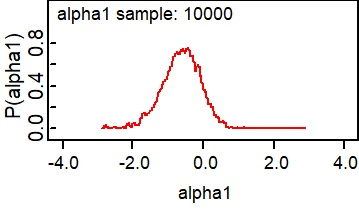
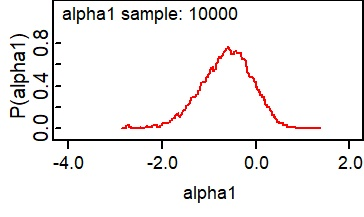

<!-- DON'T RENDER THE REPORT BY HAND DIRECTLY! -->

<!-- use `targets::tar_make()` instead -->

```{r setup, include=FALSE}
options(
  width = 90,
  tidyverse.quiet = TRUE
)

knitr::opts_chunk$set(
  echo = FALSE,
  collapse = TRUE,
  comment = ""
)

library(glue)
library(here)
library(targets)
library(tidyverse)

list.files(here("R"), pattern = "\\.R$", full.names = TRUE) |>
  lapply(source) |> invisible()
```

```{r, include=FALSE}
knitr::write_bib(file = './reports/packages.bib')
```

## Introduzione

Il progetto si concentra sull'analisi geospaziale di un'epidemia di colera nello Yemen tra il 2017 e il 2018, utilizzando varie tecniche che sfruttano la dimensione spaziale dei dati.

### Epidemiologia del colera e fattori di rischio

Il colera è un problema mondiale. È una malattia altamente virulenta che si diffonde attraverso la contaminazione di cibo e acqua [\@azman_incubation]. L'Organizzazione mondiale della sanità la considera una minaccia globale per la salute pubblica e un indicatore di iniquità e mancanza di sviluppo sociale [@who_cholera]. La presentazione tipica è un paziente con diarrea acquosa acuta grave, con casi gravi che possono causare grave disidratazione o persino la morte se non curati.

Sfortunatamente, accedere alle cure di supporto può essere complicato, anche se si rivelano economiche ed efficaci. La maggior parte dei pazienti può essere curata con successo tramite la soluzione di reidratazione orale (ORS), fino a 6 litri il primo giorno. Tali interventi dovrebbero essere disponibili a livello di comunità (Punti di reidratazione orale o ORP). Se il paziente è a rischio di shock, sono necessari liquidi per via endovenosa e antibiotici, solitamente nelle unità di trattamento del colera (CTU) o nei centri (CTC). Per i bambini di età inferiore ai 5 anni, Zync è un integratore efficace da aggiungere alla terapia ORS. **Il tasso di mortalità (CFR) dovrebbe rimanere al di sotto dell'1% quando il trattamento viene fornito precocemente.**

La malattia è causata da *Vibrio cholerae*, un batterio che ha iniziato a diffondersi nel XIX secolo dal suo serbatoio originale nel delta del Gange in India. La maggior parte delle persone infette non sviluppa alcun sintomo (ma è comunque contagiosa e diffonderà i batteri attraverso le feci per 1-10 giorni dopo l'infezione). La maggior parte di coloro che sviluppano sintomi presenta sintomi da lievi a moderati, solitamente tra 12 ore e cinque giorni. Una minoranza di pazienti svilupperà la forma grave, che minaccia la sopravvivenza del paziente [@who_cholera].

Dei numerosi sierogruppi di V. cholerae, solo O1 e O139 hanno un potenziale epidemico. L'O1 stesso ha causato tutte le recenti epidemie, ma non c'è modo di distinguerlo dai sintomi clinici mostrati dai pazienti.

La trasmissione del colera è strettamente legata alla mancanza di accesso all'acqua, servizi igienici e igienici, in particolare servizi igienici e altre strutture. Particolarmente a rischio sono le aree periurbane con condizioni precarie (baraccopoli), i campi di sfollati interni sovraffollati o le aree remote in cui la popolazione fa affidamento su fonti d'acqua non protette [@who_cholera]. Senza adeguati sistemi di gestione dei rifiuti e di igiene, le fonti d'acqua possono essere ulteriormente contaminate e il problema della scarsità d'acqua è ancora peggiore durante la siccità o le inondazioni [@one_health].

Il mondo sta attualmente vivendo la settima pandemia, iniziata nell'Asia meridionale nel 1961, che ha raggiunto l'Africa nel 1971 e le Americhe nel 1991. Ora è considerata endemica in molti paesi. L'OMS continua a segnalare un numero elevato di casi, con 44 paesi che li hanno segnalati nel 2022, per un totale di quasi 0,5 milioni di casi in tutto il mondo e oltre 2.300 decessi.

È necessaria una serie di interventi per controllare il colera e ridurre i decessi, combinando sistemi di allerta precoce e sorveglianza e rafforzando i sistemi sanitari e WASH [@who_cholera]. Il Movimento della Croce Rossa adotta un approccio a tre punte:

- **Interrompere la catena di trasmissione** attraverso la mobilitazione della comunità e l'impegno dei volontari nei Branch Outbreak Response Team. Gli interventi incorporano la cultura, le pratiche e le convinzioni locali per promuovere buone pratiche igieniche e prevenire la contaminazione o la ricontaminazione.

- **Ridurre la mortalità** attraverso la distribuzione di soluzioni di reidratazione orale in punti stabiliti (ORP) o avamposti. Ciò è fondamentale, poiché il sistema sanitario locale potrebbe non essere in grado di sviluppare il numero richiesto di ORP.

- **Campagne di vaccinazione orale contro il colera (OCV)**, ogniqualvolta siano disponibili tramite la scorta globale di OCV supportata da Gavi, la Vaccine Alliance

La tempistica appropriata di tali interventi e l'area geografica in cui devono essere implementati sono fattori cruciali nel controllo delle epidemie [@ifrc_cholera]. D'altro canto, le soluzioni a lungo termine comportano lo sviluppo dell'infrastruttura WASH e il miglioramento delle condizioni socioeconomiche [@who_cholera].

La sorveglianza è un sistema integrato che garantisce il rapido rilevamento di casi sospetti di colera, seguito dalla condivisione delle informazioni con altri livelli del sistema sanitario, fino alla notifica internazionale secondo il Regolamento sanitario internazionale (IHR). Il sospetto si basa sul sospetto clinico (diarrea acquosa acuta in un paziente di età superiore ai due anni, con grave disidratazione o decesso). I test diagnostici rapidi sono strumenti preziosi a livello di struttura sanitaria, ma non sono disponibili ovunque. Il test PCR è la consueta conferma di laboratorio effettuata dalle autorità a livello nazionale poiché anche un singolo caso è considerato un focolaio, secondo l'IHR, anche se la notifica non è più obbligatoria ma segue i criteri specificati nell'Allegato 2 [@ihr].

La Global Roadmap to Ending Cholera [@gtfcc_roadmap] è un'iniziativa di

## Materiali e Metodi

### Obiettivo principale dell'analisi

Di solito, i sistemi di allerta precoce delle malattie si concentrano sulla definizione di un livello di allerta o allarme per la suddivisione amministrativa in cui si trova il caso sospetto o confermato. Questa analisi mira a esplorare le dimensioni geografiche e temporali di un'epidemia di colera di due anni nello Yemen e a testare la fattibilità di un'allerta per le aree limitrofe con tempi di preavviso diversi.

### Piano di analisi

Data la complessità del compito, vengono mantenute alcune ipotesi:

- In questa fase, non vengono integrati dati meteorologici. Il modello si basa solo su variabili epidemiologiche in ciascuna area amministrativa.

- L'analisi si concentra sul primo livello amministrativo poiché i dati sono resi disponibili gratuitamente solo a questo livello.

- Non vengono prese in considerazione gli spostamenti della popolazione (ad esempio, rete stradale o mercati locali) o le dinamiche di spostamento (ad esempio, all'interno o attraverso il paese). Viene presa in considerazione solo la prossimità geografica delle aree amministrative.

Esplorazione delle dinamiche temporali e geografiche:

- I tassi di mortalità e di attacco devono essere uniformati tramite un modello BYM. Ciò maschererà l'effetto della sovradispersione e identificherà le aree in cui CFR e AR sono eccezionalmente elevati. Entrambe le variabili vengono calcolate nelle tre settimane precedenti (come nel documento OCHA [@drc_cholera]).

- Ogni area viene classificata in tre classi: o l'epidemia è sotto controllo (livello 0 - preparazione), i casi sono in aumento ma con CFR sotto la soglia dell'1% (livello 1 - azione precoce), o CFR è superiore all'1%, segnalando un livello di stress inaccettabile (livello 2 - risposta). Il livello 2 viene dichiarato anche se il tasso di attacco nelle quattro settimane precedenti è stato superiore a 2 ogni 1000 persone. Questa classificazione viene calcolata solo sui dati disponibili in quel momento ed è l'obiettivo della previsione.

- Il set di dati verrà analizzato per la correlazione temporale da un aumento dei casi tramite un Distributed Lag Model, identificando il miglior lead time per la fase successiva. Vengono ottenute stime aggregate per verificare la correlazione temporale di ciò con un approccio meta-analitico.

Una volta completati il ​​preprocessing e l'esplorazione, è possibile implementare le fasi di modellazione.

- L'obiettivo della previsione è il livello di un distretto specifico, con alcune settimane di anticipo, identificato nella fase di esplorazione.

- Vengono testati due modelli: il primo utilizza il numero di casi, il secondo utilizza i tassi di attacco dei distretti come variabili di input. Sono tutti modelli BYM con la classificazione a 3 livelli come covariata.

- Un quarto modello, un modello di Poisson non bayesiano, viene utilizzato anche come riferimento.

### Fonti dei dati

I dati per questo progetto provengono da due fonti primarie, entrambe accessibili tramite il portale Humanitarian Data Exchange.

#### Suddivisioni amministrative dello Yemen

L'Ufficio delle Nazioni Unite per il coordinamento degli affari umanitari ha fornito un gruppo di shapefile georeferenziati ai diversi livelli amministrativi. Per il progetto attuale, le forme vengono raccolte a livello di governatorato (adm 1) [@ocha_yemen].

Questi dati sono preparati dalla Central Statistical Organisation e distribuiti con licenza Creative Commons Attribution for Intergovernmental Organisations.

Tutti i dati possono essere scaricati da [questo sito web](https://data.humdata.org/dataset/cod-ab-yem "HDX Yemen OCHA boundaries"). In particolare, "Administrative Divisions Shapefiles.zip" contiene "yem_admbnda_adm1_govyem_cso_20191002.shp", che è stato utilizzato per il progetto una volta copiato nella cartella "data-raw".

#### Dati di aggiornamento epidemiologico dell'epidemia di colera in Yemen

Questo set di dati fornisce numeri di casi sospetti di colera, decessi, tassi di mortalità (%) e tassi di attacco (per 1.000) per governatorato nell'epidemia di colera in Yemen dal 27 aprile 2017. I dati contengono cifre da bollettini epi e bollettini settimanali e giornalieri. I dati vengono estratti manualmente dagli aggiornamenti epidemiologici dell'epidemia di colera in Yemen prodotti da WHO Yemen. Si applica la stessa licenza del set di dati precedente. Sfortunatamente, dopo il 18 febbraio 2018, gli aggiornamenti a livello di governatorato sono stati interrotti [@epi_yemen].

Tutti i dati possono essere scaricati da [questo sito web](https://data.humdata.org/dataset/yemen-cholera-outbreak-daily-epidemiology-update? "WHO Yemen cholera updates"), in particolare "Yemen Governorate Level Cholera Epidemiology Data.csv", che è stato poi utilizzato per il progetto una volta copiato nella cartella "data-raw". Sono disponibili diverse variabili, in **grassetto** quella mantenuta per analisi successive.

- **Data** in cui sono stati riportati i dati

- Il nome del **Governatorato**, come riportato nel bollettino epidemiologico dell'OMS

- Numero di **Casi** registrati nel governatorato dal 27 aprile 2017

- Numero di **Decessi** registrati nel governatorato dal 27 aprile 2017

- **CFR** (%), il tasso di mortalità nel governatorato dal 27 aprile 2017

- **Tasso di attacco** (per 1000), il tasso di attacco per 1.000 abitanti

- COD Gov inglese/COD Gov arabo/COD Gov Pcode (3 colonne). Il nome inglese/arabo/PCODE per il governatorato secondo i Common Operation Dataset (COD) dell'Inter-Agency Standing Committee (IASC) per lo Yemen

- Il tipo di bollettino da cui sono stati estratti i dati (include Bollettino epidemiologico, Bollettino epidemiologico settimanale, Aggiornamento epidemiologico giornaliero)

- L'URL del bollettino da cui sono stati estratti i dati.

### Pre-elaborazione dei dati

Gli strumenti principali per l'intero progetto sono stati R Statistical Software [@rlanguage] e OpenBugs [@lunn_bugs_2009] per la modellazione bayesiana. È stato creato un repository GitHub per facilitare il controllo delle versioni ed è stato utilizzato il modello laims.analysis. Il modello incorpora la maggior parte delle librerie necessarie per ridurre la creazione e la manutenzione della pipeline e isola l'intero progetto come un pacchetto. La pipeline completa può essere visualizzata nell'immagine sottostante.

```{r}
targets::tar_visnetwork(targets_only = TRUE,exclude = starts_with("fig"))
```

La figura sopra mostra diversi passaggi di pre-elaborazione, disponibili come parte del pacchetto:

- Raggruppamento dei dati da diversi report per settimana epidemiologica e governatorato in modo che possano essere visualizzati e analizzati in un intervallo di tempo costante

- Unione dello shapefile Yemen con i dati epidemiologici (casi, decessi, CFR e tasso di attacco), raggruppati per settimana epidemiologica.

- Calcolo della matrice di adiacenza utilizzata per i modelli BYM.

- Calcolo della variabile target e del CFR trisettimanale, nonché nuovi casi e tasso di attacco, come da piano analitico.

## Risultati e discussione

Risultati e discussione seguono la pipeline delineata sopra. Le informazioni sull'integrità dei dati vengono verificate prima che i risultati vengano presentati.

### Esplorazione e visualizzazione dei dati - Tendenze temporali

Le quattro variabili principali utilizzate per tracciare un'epidemia di colera sono il numero di casi, il tasso di attacco, i decessi e il tasso di mortalità. Per avere un quadro generale, vengono visualizzati i valori assoluti (dall'inizio dell'epidemia), sia per distretto che cumulativamente.

```{r, figures-1b-cases}
#Fig 1b - same as 1c  but broken down by district
tar_read(fig_1b_1)
```

Sono mostrate dinamiche diverse nei 21 governatorati analizzati, con alcuni di essi (Abyan, Ad Dali, Shabwa, ...) che mostrano un arresto dopo l'aumento iniziale, mentre altri che non sono mai riusciti a controllare i focolai (Dhamar, Sanaa, sia rurali che urbane, Raymah, ...).

Un altro fenomeno interessante sono i picchi improvvisi nella derivata prima, come si può osservare a Sanaa (rurale), Hadramawt o Shabwah, dove i nuovi casi sono raggruppati in un breve lasso di tempo che è indicativo di un immediato peggioramento della situazione.

```{r, figures-1b-ar}
tar_read(fig_1b_2)
```

Il tasso di attacco è una variabile fondamentale che determina le risorse necessarie per controllare un focolaio. Poiché è calcolato sui nuovi casi e sulla popolazione, il tasso di attacco segue una forma simile ai nuovi casi, ma è il picco più indicativo. Distretti come Al Mahwit e Amran (AR = 75 per mille) sono tra i governatorati più colpiti, mentre a Sadah (AR = 12) e Hadramawt (AR = 1,5), la maggior parte delle persone è riuscita a evitare l'infezione. Altri fattori potrebbero spiegare che i test limitati sono dovuti a condizioni di accesso volatili, ma in generale, l'analisi del tasso di attacco mostra dinamiche diverse in tutto il paese.

```{r, figures-1b-deaths}
tar_read(fig_1b_3)
```

I decessi sono un risultato difficile che di solito è facile da segnalare a livello di struttura sanitaria rispetto ad altri indicatori. Anche in questo caso, c'è una variabilità significativa tra le regioni, da solo pochi decessi registrati (Sadah, Shabwah) a centinaia di essi (Amran, Ibb, Taiz,...). Poiché il colera di solito non causa disabilità permanenti, il decesso è il risultato più importante da monitorare, ma per quanto riguarda il numero assoluto di nuovi casi, per comprenderne le implicazioni, è necessaria una nuova metrica.

```{r, figures-1b-cfr}
tar_read(fig_1b_4) +
  geom_hline(yintercept = 1, color = "red")
```

Il tasso di mortalità, oltre a stabilire standard per l'assistenza fornita (dovrebbe essere \<1%), è anche un fattore che mostra l'efficacia del sistema sanitario nel suo complesso. Il set di dati mostra il CFR assoluto (dall'inizio dell'epidemia), quindi è l'unica variabile che sta diminuendo costantemente. Questo, tuttavia, non fornisce informazioni sull'evoluzione momento per momento dell'epidemia.

Inoltre, è degno di nota che si è registrato un picco all'inizio dell'epidemia nella maggior parte delle regioni. Ciò è dovuto a una combinazione di fattori: all'inizio, i casi confermati sono bassi e sono solitamente i peggiori in termini di condizioni cliniche. Anche l'aumento della capacità del sistema sanitario e delle attività di comunicazione del rischio sono modi efficaci per ridurre la mortalità complessiva (e i decessi).

```{r, figures-1c-upper, fig.show="hold", out.width="50%"}
#Fig 1c - whole epidemic curve (4 panels with the four epi variables)
tar_read(fig_1c_1)
tar_read(fig_1c_2) +
  geom_hline(yintercept = 1, color = "red")
```

Da un punto di vista nazionale, l'epidemia non è mai stata sotto controllo durante il periodo di studio, probabilmente a causa dei fattori di vulnerabilità delineati nell'introduzione. Ciò è diverso dai dati a livello di governatorati, in cui il livellamento dei casi in alcuni distretti è un segno di un'epidemia controllata. In particolare, i decessi e il CFR hanno un comportamento interessante che non era evidente dai dati precedenti: i decessi aumentano costantemente fino a luglio 2024 con un tasso di crescita costante (lineare), ma da quel momento in poi la crescita è più lenta.

```{r, figures-1c-lower, fig.show="hold", out.width="50%"}
tar_read(fig_1c_3)
tar_read(fig_1c_4)
```

Anche se i dati cumulativi sono il modo standard per raccogliere tali informazioni, sono state calcolate variabili aggiuntive nella pre-elaborazione per mostrare quelle cumulative solo per le quattro settimane precedenti. Ciò fornisce un quadro diverso, più rappresentativo di ciò che è accaduto nel mese precedente per quella particolare settimana.

```{r, figures-1e, fig.show="hold", out.width="50%"}
#Fig 1e - distribution of new cases and attack_rate  
tar_read(fig_1e_1)
tar_read(fig_1e_2)
```

```{r, figures-1f, fig.show="hold", out.width="50%"}
#Fig 1f - distribution of new_deaths and cfr  
tar_read(fig_1f_1) 
tar_read(fig_1f_2) +
  scale_x_sqrt() +
  xlim(-1,5) +
  geom_vline(xintercept = 1, color = "red")
```

Tutte le distribuzioni univariate sono distorte a sinistra, come di consueto per le epidemie (i valori di mortalità negativi sono correlati a errori di segnalazione). Combinate, mostrano una situazione in cui, nella maggior parte dei distretti, la situazione è stata gestita in modo da evitare un disastro umanitario. Infatti, anche in aree particolari in cui si sono verificate situazioni di gravi necessità umanitarie, gli sforzi concertati delle autorità sanitarie e dei partner internazionali sono riusciti a contenere la diffusione incontrollata delle malattie.

```{r, figures-1d, fig.show="hold", out.width="33%"}
# Fig 1d - Three examples of different epi statuses situation w/colours  
tar_read(fig_1d_1) #Epi 2017-23 (early June) 
tar_read(fig_1d_2) #Epi 2017-35 (early September) 
tar_read(fig_1d_3) #Epi 2017-51 (early December)
```

Dalle variabili epidemiologiche chiave, è possibile calcolare uno stato generale a 3 codici. Il cut-off è stato definito nell'ambito di questo lavoro senza convalida esterna (ad esempio, con strumenti di valutazione del rischio a livello governativo). Tuttavia, utilizza definizioni simili:

- Un'area verde è un'area senza nuovi casi nelle ultime quattro settimane (che è leggermente più breve dello standard OMS di 40 giorni)

- Un'area arancione è un'area con un focolaio attivo in cui il sistema sanitario sta rispondendo in modo efficace

- Un'area rossa è un'area in cui le risorse del sistema sanitario non sono sufficienti per mantenere il CFR al di sotto della soglia dell'1% (che rappresenta una situazione in cui i malati accedono alle cure appropriate e il numero adeguato di casi viene intercettato dal personale sanitario), o un tasso di attacco superiore a 2 (x1000) che segnala un alto livello di trasmissione nella comunità o il fallimento delle misure di mitigazione.

Combinato, lo stato fornisce uno scorcio della situazione nel paese. Questa è una variabile target utile da prevedere, date le domande dirette a cui può rispondere per la gestione delle operazioni umanitarie.

### Esplorazione e visualizzazione dei dati - Correlazioni

Come fase preliminare, vengono verificate le correlazioni con le variabili epidemiologiche chiave prima di verificare ulteriori strategie di modellazione.

```{r, figures-2a}
#Fig 2a - correlation between new cases and deaths
tar_read(fig_2_a) +
  labs(x = "Cases", y = "Deaths")
```

È previsto un certo grado di correlazione tra casi mensili e decessi per le diverse settimane. Il modello lineare si adatta al grafico di densità bidimensionale. La correlazione è più solida per molti nuovi casi e la tendenza è pressoché lineare. Poiché la malattia impiega tempo per uccidere una persona infetta, questo risultato iniziale richiede un modello di correlazione ritardata per verificare se il collegamento è più forte.

```{r, figures-2b}
#Fig 2b - correlation between new cases and cfr
tar_read(fig_2_b) +
  ylim(-0.2,3)
```

Lo stesso schema non è così evidente per il Case Fatality Rate, anche se più casi sono associati a un CFR più elevato nello stesso periodo. Anche in questo caso, il modello preliminare suggerisce un approccio diverso che incorpora considerazioni di ritardo di un paio di settimane.

```{r,figures-2c-upper, fig.show="hold", out.width="50%"}
#Fig 2c - correlation between status and 4 epi variables (4 panels)
tar_read(fig_2c_1)
tar_read(fig_2c_2)
```

```{r,figures-2c-lower, fig.show="hold", out.width="50%"}
#Fig 2c - correlation between status and 4 epi variables (4 panels)
tar_read(fig_2c_3)
tar_read(fig_2c_4)
```

Il modo in cui è stata costruita la variabile di stato impone un certo livello di correlazione tra le variabili. Ciò è meno evidente per le prime due variabili (casi e decessi) poiché per determinarle vengono utilizzati il ​​tasso di attacco e il CFR.

### Serie temporali

Esistono diversi metodi per controllare i modelli stagionali e a lungo termine negli studi sulle serie temporali. Dato il numero limitato di anni, non è possibile modellare alcuna stagionalità. La componente a lungo termine viene aggiunta al modello poiché la crescita dei casi è aumentata lentamente. Si prevede che sia non lineare applicando spline per modellare tendenze temporali uniformi, inizialmente con 5 gradi di libertà per ogni anno di dati.

```{r}
tar_read(epi_conf)
```

Il modello iniziale è una versione più sofisticata del grafico mostrato sopra, che indica chiaramente che le variabili epidemiologiche e le componenti temporali influenzano l'esito. Questa associazione non è molto forte, poiché la devianza residua è simile a quella Null. Pertanto, è difficile determinare lo stato dalle variabili originali, ma ciò è prevedibile poiché il modello presentato non considera alcun effetto di ritardo o considerazioni geografiche.

Nella seconda iterazione, viene valutata l'associazione tra lo stato e le quattro variabili epidemiologiche (nel mese precedente), tenendo conto delle associazioni ritardate fino a quattro settimane. Viene definita una funzione bidimensionale esposizione-ritardo-risposta (cross-basis), con quattro diversi modelli che possono essere adattati da essa.

```{r,figures-3a-1, fig.show="hold", out.width="50%"}
tar_load(ycc_lag)
cb_cases <- dlnm::crossbasis(
  ycc_lag["cases_4w"],
  lag=4,
  argvar=list(fun="lin"),
  arglag=list(fun="integer")
)
spltime <- splines::bs(ycc_lag$date, df=2*3)
mod_cases <- glm(status ~ cb_cases + spltime,
                 family=quasipoisson(),
                 ycc_lag)

cp_cases <- dlnm::crosspred(cb_cases, mod_cases, at=0:6000, by=10)
plot(cp_cases, "slices", var=3000, ci="bars", pch=19, col=2, main="Alternative lag-response functions at Cases = 1200")
plot(cp_cases, "overall", ci="lines", col=2, lty=2,
      main="Overall cumulative association", lwd=2, xlab="New cases")

```

```{r,figures-3a-2, fig.show="hold", out.width="50%"}
cb_deaths <- dlnm::crossbasis(
  ycc_lag["deaths_4w"],
  lag=4,
  argvar=list(fun="lin"),
  arglag=list(fun="integer")
)
spltime <- splines::bs(ycc_lag$date, df=2*3)
mod_deaths <- glm(status ~ cb_deaths + spltime,
                 family=quasipoisson(),
                 ycc_lag)

cp_deaths <- dlnm::crosspred(cb_deaths, mod_deaths, at=0:50, by=1)
plot(cp_deaths, "slices", var=20, ci="bars", pch=19, col=2, main="Alternative lag-response functions at Deaths = 20")
plot(cp_deaths, "overall", ci="lines", col=2, lty=2,
      main="Overall cumulative association", lwd=2, xlab="New deaths")

```

```{r,figures-3a-3, fig.show="hold", out.width="50%"}
cb_cfr <- dlnm::crossbasis(
  ycc_lag["cfr_4w"],
  lag=4,
  argvar=list(fun="lin"),
  arglag=list(fun="integer")
)
spltime <- splines::bs(ycc_lag$date, df=2*3)
mod_cfr <- glm(status ~ cb_cfr + spltime,
                 family=quasipoisson(),
                 ycc_lag)

cp_cfr <- dlnm::crosspred(cb_cfr, mod_cfr, at=0:5, by=0.1)
plot(cp_cfr, "slices", var=1, ci="bars", pch=19, col=2, main="Alternative lag-response functions at CFR = 1")
plot(cp_cfr, "overall", ci="lines", col=2, lty=2,
      main="Overall cumulative association", lwd=2, xlab="CFR")

```

```{r,figures-3a-4, fig.show="hold", out.width="50%"}
cb_ar <- dlnm::crossbasis(
  ycc_lag["attack_4w"],
  lag=4,
  argvar=list(fun="lin"),
  arglag=list(fun="integer")
)
spltime <- splines::bs(ycc_lag$date, df=2*3)
mod_ar <- glm(status ~ cb_ar + spltime,
                 family=quasipoisson(),
                 ycc_lag)

cp_attack <- dlnm::crosspred(cb_ar, mod_ar, at=0:5, by=0.05)
plot(cp_attack, "slices", var=3, ci="bars", pch=19, col=2, main="Alternative lag-response functions at Attack Rate = 3")
plot(cp_attack, "overall", ci="lines", col=2, lty=2,
      main="Overall cumulative association", lwd=2, xlab="Attack rate")
```

Sono mostrati l'effetto a un particolare cut-off e l'associazione cumulativa complessiva. Nessuno dei grafici contiene alcun risultato significativo per un ritardo di 1 settimana o più. Pertanto, la modellazione basata solo su variabili epidemiologiche non è sufficiente per prevedere lo stato in modo accurato. Inoltre, la deviazione residua dai modelli (non mostrata) è simile al modello iniziale, senza alcun beneficio nella varianza residua dalle considerazioni aggiuntive sul ritardo.

L'ultima iterazione è per verificare l'associazione a livello di singolo governatorato e viene utilizzato un approccio a due stadi:

- Un modello di regressione in cui l'associazione di interesse è stimata in ogni posizione, identico al primo modello sviluppato sopra;

- Una meta-analisi per raggruppare le stime tra le posizioni.

Questo non considera l'effetto della prossimità geografica, solo l'associazione temporale tra le stime.

```{r,figures-3b, fig.show="hold", out.width="33%"}
tar_load(log_epi)
regs <- log_epi[["Governorate"]] |> unique()

uni_cases <- metafor::rma(
  yi=log_epi[["Cases"]], 
  sei=log_epi[["CasesSE"]],
  slab=regs,
  measure="RR"
  )
metafor::forest(uni_cases, transf=exp, refline=1, pch=23, bg=4, col=2,
  main="New cases and Status")

uni_deaths <- metafor::rma(
  yi=log_epi[["Deaths"]], 
  sei=log_epi[["DeathsSE"]],
  slab=regs,
  measure="RR"
  )
metafor::forest(uni_deaths, transf=exp, refline=1, pch=23, bg=4, col=2,
  main="New deaths and Status")

uni_cfr <- metafor::rma(
  yi=log_epi[["CFR"]], 
  sei=log_epi[["CFRSE"]],
  slab=regs,
  measure="RR"
  )
metafor::forest(uni_cfr, transf=exp, refline=1, pch=23, bg=4, col=2,
  main="CFR and Status")

```

Anche in questo caso, non si ottiene alcun risultato significativo. Le diverse intensità delle associazioni nel distretto, ciascuna per le variabili epidemiologiche, non sono abbastanza forti da spiegare un cambiamento di stato.

### Tendenze ecologiche

La modellazione delle tendenze ecologiche richiede la definizione della variabile target appropriata. In ogni settimana, il modello cercherà di prevedere lo stato di quel distretto in quella successiva (quindi con un ritardo di una settimana).

Vengono testati tre modelli, con diverse variabili epidemiologiche (casi o tasso di attacco, poiché erano gli unici nella sezione precedente a mostrare un'associazione cumulativa) e lo stato dei distretti come covariate. Un modello Poisson-gamma senza considerazione spaziale viene utilizzato per fornire un riferimento.

#### Modello 0 - nessuna componente spaziale

Il primo modello è un semplice modello Poisson-gamma senza considerazione spaziale. Le variabili sono il numero previsto di casi e lo stato nella settimana precedente, che vengono utilizzati per prevedere lo stato nella settimana successiva.

```{r}
tar_read(mod0) |> summary()
```

I risultati, nonostante mostrino un'associazione significativa per entrambe le variabili, non sono indicativi di per sé e dovrebbero essere considerati una linea di base.

#### Modello 1 - Casi

Il primo modello BYM è simile al precedente, ma presenta considerazioni spaziali aggiuntive.

Poiché si tratta di un progetto pilota, a causa della complessità computazionale, viene eseguito solo il modello BYM per l'inizio di dicembre (settimana Epi 2017-51).

```{odc}
model
{
	for (i in 1 : 21)
	{
			target_status[i]  ~ dpois(mu[i])
			log(mu[i]) <- log(cases_exp[i]) + alpha0 + b.ete[i] + b.clu[i] + alpha1*status[i]
			rr[i] <- exp(alpha0+b.ete[i]+b.clu[i]) 
			b.ete[i]~dnorm(0,tau.ete)
			post[i]<-step(rr[i]-1)
	}
	
	b.clu[1:21] ~ car.normal(adj[], weights[],num[],tau.clu)
	
	sd.clu<-sd(b.clu[])
	sd.ete<-sd(b.ete[])
	
	alpha0  ~ dflat()
	alpha1  ~ dnorm(0, 0.0001)
	tau.ete ~ dgamma(0.5,0.0005)
	sigma.ete <-sqrt(1/tau.ete)
	tau.clu ~ dgamma(0.5,0.0005)
	sigma.clu <-sqrt(1/tau.clu)
}
```

Dopo aver inizializzato correttamente questo modello, possiamo fornire un riepilogo del coefficiente di stato stimato. Ciò mostra una tendenza verso un valore negativo della variabile Stato, dove gli stati più elevati (uguali a "situazione peggiore") sono inversamente associati a uno stato più elevato in una determinata regione.



```{r}
tar_read(mod1_alphas)
```

D'altro canto, l'effetto di alpha0 sembra molto più grande.

#### Modello 2 - Tasso di attacco

```{odc}
model
{
	for (i in 1 : 21)
	{
			target_status[i]  ~ dpois(mu[i])
			log(mu[i]) <- log(cases_exp[i]) + alpha0 + b.ete[i] + b.clu[i] + alpha1*status[i]
			rr[i] <- exp(alpha0+b.ete[i]+b.clu[i]) 
			b.ete[i]~dnorm(0,tau.ete)
			post[i]<-step(rr[i]-1)
	}
	
	b.clu[1:21] ~ car.normal(adj[], weights[],num[],tau.clu)
	
	sd.clu<-sd(b.clu[])
	sd.ete<-sd(b.ete[])
	
	alpha0  ~ dflat()
	alpha1  ~ dnorm(0, 0.0001)
	tau.ete ~ dgamma(0.5,0.0005)
	sigma.ete <-sqrt(1/tau.ete)
	tau.clu ~ dgamma(0.5,0.0005)
	sigma.clu <-sqrt(1/tau.clu)
}
```



```{r}
tar_read(mod2_alphas)
```

Alpha 1 è simile al modello precedente, anche se viene mostrato un effetto opposto per alpha0.

## Conclusioni

Le dinamiche spaziali del colera rimangono elusive mentre cerchiamo di modellarle. Questo breve rapporto ha analizzato alcuni modelli temporali e spaziali (ma non i due insieme) come momento esplorativo prima che venissero testate tecniche diverse.

La classificazione dello stato non cattura completamente l'evoluzione dell'epidemia, come hanno mostrato le due analisi, ma è in qualche modo indicativa del potere predittivo per l'evoluzione della settimana successiva. Il coefficiente negativo derivato in entrambi i modelli BYM, confrontato con quello prossimo allo zero, mostra che quando vengono prese in considerazione le relazioni spaziali, c'è una relazione inversa tra lo stato di un distretto e quello degli altri.

## Ringraziamenti {.appendice}

Questo rapporto (e pacchetto) è stato preparato come parte del Master in Geostatistica per la Salute come lavoro di progetto finale. I dati sono stati acquisiti tramite Humanitarian Data Exchange (vedere la sezione pertinente sopra sulle fonti dei dati), gentilmente forniti dall'Ufficio delle Nazioni Unite per il coordinamento degli affari umanitari (UN OCHA) e dall'Organizzazione mondiale della sanità (OMS) insieme al Ministero della salute dello Yemen.

## Contributi degli autori {.appendice}

AP ha preparato la prima bozza del piano di analisi, che FP e DC hanno discusso e migliorato e su cui hanno fornito un feedback continuo. CL ha sviluppato il modello di analisi delle richieste.

## Environment {.appendix}

<details>

<summary>Session info</summary>

```{r, results='markup'}
devtools::session_info()
```

</details>
