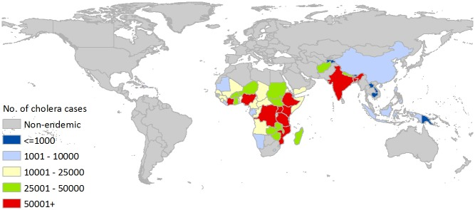
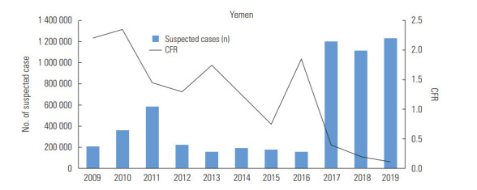

<!-- DON'T RENDER THE REPORT BY HAND DIRECTLY! -->

<!-- use `targets::tar_make()` instead -->

```{r setup, include=FALSE}
options(
  width = 90,
  tidyverse.quiet = TRUE
)

knitr::opts_chunk$set(
  echo = FALSE,
  collapse = TRUE,
  comment = ""
)

library(glue)
library(here)
library(targets)
library(tidyverse)

list.files(here("R"), pattern = "\\.R$", full.names = TRUE) |>
  lapply(source) |> invisible()
```

```{r, echo=FALSE}
htmltools::img(
 src = knitr::image_uri(here("man", "img", "LAIMS.png")),
 alt = 'logo',
 style = 'position:absolute; top:0; right:0; padding:10px;'
 )
```

```{r, include=FALSE}
knitr::write_bib(file = 'packages.bib')
```

```{r packages, include=FALSE}

```

## Introduction

The project focuses on the geospatial analysis of a cholera outbreak in Yemen between 2017 and 2018, using various techniques that leverage the spatial dimension of data.

### Cholera epidemiology and risk factors

Cholera is a worldwide problem. It is a highly virulent disease that spreads through the contamination of food and water [\@azman_incubation]. The World Health Organization considers it a global threat to public health and an indicator of inequity and lack of social development [@who_cholera]. The typical presentation is a patient with severe acute watery diarrhoea, with severe cases that can cause severe dehydration or even death if left untreated.

Unfortunately, accessing supportive care can be complicated, even if it proves cheap and effective. Most patients can be treated successfully through the Oral Rehydration Solution (ORS), up to 6 litres on the first day. Those interventions should be available at the community level (Oral Rehydration Points, or ORP). If the patient is at risk of shock, intravenous fluids and antibiotics are required, usually in Cholera Treatment Units (CTUs) or Centers (CTCs). For under-5 children, Zync is an effective supplement to add to ORS therapy. **The Case Fatality Rate (CFR) should remain under 1% when treatment is provided early.**

The disease is caused by *Vibrio cholerae*, a bacteria that began spreading during the 19th century from its original reservoir in the Ganges delta in India. Most people infected don't develop any symptoms (but are nevertheless contagious and will shed the bacteria through their faeces for 1-10 days after infection). Most of those who develop symptoms have mild to moderate ones, usually between 12 hours and five days. A minority of patients will develop the severe form, which is threatening patient survival [@who_cholera].

Out of the many serogroups of *V. cholerae*, only O1 and O139 have an outbreak potential. O1 itself caused all the recent outbreaks, but there is no way to distinguish them from the clinical symptoms shown by the patients.

Cholera transmission is closely linked to the lack of Water Access, Sanitation, and Hygiene services, particularly restrooms and other facilities. Particularly at high risk are peri-urban areas with precarious conditions (slums), overcrowded Internally Displaced People camps, or remote areas where the population relies on unprotected water sources [@who_cholera]. Without proper sanitation and waste management systems, water sources can become further contaminated, and the water scarcity problem is even worse during drought or flooding [@one_health].

The World is currently experiencing the 7th pandemic, which started in South Asia in 1961, reached Africa in 1971, and the Americas in 1991. It is now considered endemic in many countries. WHO continues to report a high number of cases, with 44 countries reporting them in 2022, for a total of nearly 0.5 million cases worldwide and more than 2,300 deaths.

A series of interventions is required to control cholera and to reduce deaths, with a combination of early warning and surveillance systems, along with health and WASH systems strengthening [@who_cholera]. The Red Cross Movement adopts a three-pronged approach:

-   **Break the transmission chain** through community mobilisation and volunteer engagement in Branch Outbreak Response Teams. The interventions are developed to incorporate local culture, practices, and beliefs to promote good hygiene practices to prevent contamination or re-contamination.

-   **Lower mortality** through Oral Rehydration Solution distribution in established points (ORPs) or outposts. This is critical, as the local health system may not have the capacity to establish the required number of ORPs.

-   **Oral Cholera Vaccination (OCV) campaigns**, whenever those are available through the Global OCV stockpile supported by Gavi, the Vaccine Alliance

The appropriate timing of those interventions and the geographical area where they need to be implemented are crucial factors in Outbreak Control [@ifrc_cholera]. On the other hand, long-term solutions entail developing the WASH infrastructure and improving socio-economic conditions [@who_cholera].

Surveillance is an integrated system that ensures prompt detection of suspected cholera cases, followed by information sharing with other health system levels, up to international notification according to the International Health Regulations (IHR). The suspect is based on clinical suspicion (acute watery diarrhoea in a patient older than two years, with severe dehydration or death). Rapid diagnostic tests are valuable tools at the healthcare facility level but are not available everywhere. The PCR test is the usual laboratory confirmation carried out by country-level authorities since even a single case is considered an outbreak, as per the IHR, even if the notification is no longer mandatory but follows the criteria specified in Annex 2 [@ihr].

The Global Roadmap to Ending Cholera [@gtfcc_roadmap] is an initiative of the Global Taskforce on Cholera Control that focuses on three strategic axes:

1.  Early detection and quick response to contain outbreaks

2.  A targeted multi-sectoral approach to prevent cholera recurrence, focusing on cholera hotspots, which are relatively small areas that are the most chronically affected by cholera cases

3.  An effective mechanism of coordination for technical support, advocacy, resource mobilisation, and partnership at local and global levels

This thesis project focuses on the First Strategic Pillar and aims to prove the feasibility of Anticipatory Approaches to cholera outbreaks.

### Cholera burden globally

Unfortunately, the global burden of cholera is unknown mainly because the majority of cases are not reported. The low reporting can be attributed to the limited capacity of epidemiological surveillance and laboratories and social, political, and economic disincentives for reporting.

Approximately 1.3 billion people are at risk for cholera in endemic countries. An estimated 2.86 million cholera cases (uncertainty range: 1.3m-4.0m) occur annually in endemic countries. Among these cases, there are an estimated 95,000 deaths (uncertainty range: 21,000-143,000) [@cholera_burden].

[](https://www.ncbi.nlm.nih.gov/pmc/articles/PMC4455997/figure/pntd.0003832.g002/)

### Cholera Burden in Yemen

According to the World Bank, Yemen is a lower-middle-income country with a population of more than 26 million. However, due to ongoing conflicts, its population health indicators are some of the lowest in the world[@wb].

Yemen is considered a country where Cholera is endemic, given that cases are routinely observed. The Global burden of disease estimates 10.7 million people at risk, with an incidence rate (1000) of 1.64 and more than 17500 cases annually, a Case Fatality Rate of 3.2, and 561 deaths annually [@cholera_burden]. Cumulatively, between 2016 and 2021, more than 2.5 million cases were reported, including 4000 deaths [@echo_yemen].

The current analysis focuses on the 2017-2018 outbreak, but even at the end of 2023, cholera cases surged in six governorates in Yemen. According to the DG ECHO, 80% of cases were among migrants [@echo_yemen]. Nonetheless, the Ministry of Public Health and Population in Aden declared the official outbreak at the national level only later. In March, there was an increase again in the northern governorates with over 6000 suspected cholera cases, 56 deaths (case fatality rate of 0.9%), and 47% of cases being clinically severe [@unicef_yemen]. In June 2024, the International Organisation on Migration (IOM) raised concerns over 30,000 suspected cases, with the potential of reaching 255,000 by September 2024 if preparedness and response activities are not scaled up [@iom_yemen].

Yemen experienced the most significant reported cholera outbreak in recent history, from 2016 to 2022. The analysis focuses on a short period for which epidemiological data are available. The main driver has been a protracted civil war, which damaged the already vulnerable health and WASH infrastructure. Chronic malnutrition, cyclical floods, and drought episodes have compounded this[@one_health].

[](https://www.ncbi.nlm.nih.gov/pmc/articles/PMC7411249/figure/f1-jpmph-20-154/)

The situation worsened in late 2016, as seen from the Chart. This resulted in more than 16 million people without essential services and more than 2 million IDPs being forced to live in deprived and harsh environments. This contributed to a sustained number of cases, probably due to groundwater contamination and a general lack of safe drinking water in the country [@one_health]. A national electronic Disease Early Warning System (eDEWS) was established in 2016 and used together with the Bulletin of the Yemen Ministry of Health to monitor the evolution of the outbreak, providing a reliable source of data even if not always timely due to the ongoing conflict [@ews_yemen].

Increased rainfall, flooding, and a particularly strong El Niño and winds may have further contaminated water sources in Yemen and aided the spread of cholera-contaminated flying insects (chironomids) from the Horn of Africa to Yemen [@paz_cholera_2019].

### Anticipatory Action

The UN Office for the Coordination of Humanitarian Affairs (OCHA) defines Anticipatory Action (AA) as those taken ahead of a disaster to support vulnerable communities. AA emerges from the increasing confidence that we can predict the occurrence and impact of some hazards [@aa_ocha].

It is composed of three main components:

1.  A pre-agreed trigger consists of thresholds and decision-making rules based on reliable, timely, and measurable forecasts. The advancement of weather forecasting and climate science enables more actions [@aa_rccc].

2.  **Pre-agreed activities:** This consists of accountable, feasible, effective and efficient actions to be implemented to support vulnerable communities in the window of opportunity between the trigger moment and the full impact of a shock

3.  **Pre-arranged financing:** This consists of guaranteed funding available to be released based on the pre-agreed trigger for the pre-agreed activities.

The Red Cross Movement usually adds a fourth component: the Capacity to implement those actions on time. This is crucial, and capacity-building efforts are needed to ensure readiness is non-trivial. Depending on the type of hazard and forecasts available, anticipatory action can be carried out well ahead of the shock (for slower onset events) or just before the impacts fully take hold (for more rapid-onset events) [@aa_ahub].

The International Federation of Red Cross Red Crescent Societies defines with a broader scope the actions taken to reduce the humanitarian impacts of a forecast hazard before it occurs or before its most acute impacts are felt [@aa_ifrc, @aa_ifrc2]. This additional component enables the definition to be extended to epidemics.

The decision to act is based on a forecast, or collective risk analysis, of when, where and how the event will unfold. Anticipatory action is reshaping the humanitarian system, shifting from reacting to hazards to acting ahead of them [@aa_ahub].

### Anticipatory Action for Epidemics

Even if the attention is great on Anticipatory Action for Epidemics, only a few viable examples are available. Anticipation Hub recognises that technological progress in scientific modelling and forecasting systems are enabling better predictions of who, how, when and where people might be affected by disease outbreaks and epidemics [@aa_health].

Health hazards differ from weather-related ones in different ways:

-   Risk Analysis and Early Warning systems in the health sector are radically differentsince forecasting models are of a different nature. Also, it is widespread in the Health sector to base clinical and public health decisions on risk assessment tools instead of relying on hard thresholds. This is done to enable contextual information, difficult to capture in triggers, to be part of the decision process [@who_risk]

-   Political sensitivity of activation, which makes relying on historical data difficult, given both the delays in reporting and the different capacity of health systems to report

-   Early Actions are interlinked with the disaster impact. In fact, while for cyclones AA can reduce the impact, for Epidemics the number of cases itself depend on the Early Actions, thus changing the disaster

In 2021, World Health Organization (WHO), UNICEF, the International Organization for Migration (IOM), as well as scientists and researchers from the medical, public health, and climate communities are working to test if anticipatory action can stop an outbreak from becoming a crisis in Yemen, Mozambique, and the Democratic Republic of the Congo. The pilot initiative, part of a larger portfolio to scale up anticipatory action, is co-sponsored by the UN Office for the Coordination of Humanitarian Affairs (OCHA), the Global Task Force on Cholera Control (GTFCC), the Risk-Informed Early Action Partnership (REAP), the UK Government, and the Red Cross, and financed by the UN Central Emergency Response Fund (CERF) [@aa_health2].

Particularly in the trigger part, it is recognized that triggers can take into consideration different factors:

-   Suspected cholera cases before confirmation from the laboratory or reported cases in nearby locations to anticipate preparedness activities and scale up surveillance systems

-   Sudden shocks such as floods, drought or large displacement waves.

-   A reduction in vaccine coverage or deteriorating water and sanitation conditions.

-   Temperature, rainfall and other predictable environmental factors will provide significant additional lead time and help dynamically target at-risk areas, including where to detect contaminated water.

-   ...

Those different possibilities have been reduced to three main approaches in the recent "Anticipatory Action for Epidemics" briefing from the Anticipation Hub [@alcayna_anticipatory_2023], with also suggestions on how to develop them:

1.  Identify the health impacts linked to hydrometeorological hazards, including a health component into existing protocols for other hazards, such as floods or cyclones.

2.  Multi-stepped composite (surveillance and aggravating factors). This approach combines different indicators, including surveillance data on the disease of interest and known drivers of disease transmission, to establish a composite trigger.

3.  Mathematical models predict outbreak risk and the probability of a future outbreak in a given country or location.

That said, developing a protocol for Epidemics requires shifting the mindset from preventing an outbreak to preventing it from reaching critical levels.

## Methods

### Main objective of the Analysis

Usually, disease Early Warning systems focus on defining an alert or alarm level for the administrative subdivision where the suspected or confirmed case is found. This analysis aims to explore the geographical and temporal dimensions of a two-year-long Cholera outbreak in Yemen and test the feasibility of an alert for neighbouring areas with different lead times.

### Analysis Plan

Given the complexity of the task, a few assumptions are kept:

-   At this stage, no meteorological data is integrated. The model relies only on epidemiological variables in each administrative area.

-   The analysis focuses on the first administrative level since data are made freely available only at this level.

-   No considerations are made for population movement (e.g., road network or local markets) or displacement dynamics (e.g., within or across the country). Only the geographical proximity of the administrative areas is considered.

Exploration of temporal and geographical dynamics:

-   Case Fatality and Attack rates need to be smoothened through a BYM Model. This will mask the effect of overdispersion and identify areas where CFR and AR are exceptionally high. Both variables are calculated in the previous three weeks (as in the OCHA paper [@drc_cholera]).

-   Each area is classified into three classes: either the outbreak is controlled (level 0 - preparedness), cases are on the surge but with CFR under the 1% threshold (level 1 - early action), or CFR is over 1%, signalling an unacceptable stress level (level 2 - response). Level 2 is declared also if the attack rate in the previous 4 weeks has been higher that 2 per 1000 people. This classification is calculated only on data available at that moment in time and is the target of prediction.

-   Two locations will be analysed for temporal correlation from a surge in cases in neighbouring districts through a Distributed Lag Model, identifying the best lead time for the following step. Pooled estimates are obtained to verify the temporal correlation of that with a meta-analytical approach.

Once the pre-processing and exploration are completed, modelling steps can be implemented

-   The target of prediction is the level of a particular district, a number of weeks in advance, identified in the exploration stage.

-   Three models are tested: the first uses the number of cases, the second the CFR, and the third the attack rates of the districts as input variables. All of them are BYM models with the 3-level classification as a covariate.

-   A fourth model, a non-bayesian Poisson model, is also used as a reference.

### Data sources

Data for this project come from two primary sources, both accessible through the Humanitarian Data Exchange portal.

#### Administrative subdivisions of Yemen

The UN Office for Coordination of Humanitarian Affairs provided a group of georeferenced shapefiles at the different administrative levels. For the current project, shapes are collected at the governorate level (adm 1) [@ocha_yemen].

Those data are prepared by the Central Statistical Organisation and distributed under a Creative Commons Attribution for Intergovernmental Organisations.

All data can be downloaded from [this website](https://data.humdata.org/dataset/cod-ab-yem "HDX Yemen OCHA boundaries"), in particular the "Administrative Divisions Shapefiles.zip" contains the "yem_admbnda_adm1_govyem_cso_20191002.shp," which has been used for the project once copied into the folder "data-raw."

#### Yemen Cholera Outbreak Epidemiology Update Data

This dataset provides numbers of suspected cholera cases, deaths, case fatality rates (%) and attack rates (per 1,000) by Governorate in the Yemen cholera outbreak since 27 April 2017. The data contains figures from epi bulletins and weekly and daily bulletins. The data are manually extracted from the Yemen cholera outbreak epidemiology updates produced by WHO Yemen. The same license as the previous dataset applies. Unfortunately, after 18 February 2018, governorate level updates were discontinued [@epi_yemen].

All data can be downloaded from [this website](https://data.humdata.org/dataset/yemen-cholera-outbreak-daily-epidemiology-update? "WHO Yemen cholera updates"), particularly the "Yemen Governorate Level Cholera Epidemiology Data.csv", which was then used for the project once copied into the folder "data-raw". Different variables are available, in **bold** the one maintained for subsequent analysis.

-   **Date** when the figures were reported

-   The **Governorate** name, as reported in the WHO epidemiology bulletin

-   Number of **Cases** recorded in the governorate since 27 April 2017

-   Number of **Deaths** recorded in the governorate since 27 April 2017

-   **CFR** (%), the case fatality rate in the governorate since 27 April 2017

-   **Attack Rate** (per 1000), the attack rate per 1,000 of the population

-   COD Gov English/COD Gov Arabic/COD Gov Pcode (3 columns). The English/Arabic/PCODE name for the governorate according to the Inter-Agency Standing Committee (IASC) Common Operation Datasets (CODs) for Yemen

-   The type of bulletin from which the data was extracted (includes Epidemiology bulletin, Weekly epidemiology bulletin, Daily epidemiology update)

-   The URL of the bulletin from which the data was extracted.

### Data pre-processing

The main tools for the whole project have been R Statistical Software [@rlanguage] and OpenBugs [@lunn_bugs_2009] for the Bayesian modelling. A GitHub repo has been created to facilitate version control and the laims.analysis template has been used. The template incorporates most of the libraries needed to reduce the pipeline creation and maintenance and isolates the whole project as a package. The complete pipeline can be seen in the image below.

```{r}
targets::tar_visnetwork(targets_only = TRUE,exclude = starts_with("fig"))
```

The above figure shows different preprocessing steps, which are available as part of the package:

-   Grouping data from different reports by Epidemiological Week and Governorate so that they can be visualised and analysed on a constant time frame

-   Merging the Yemen shapefile with the epidemiological data (cases, deaths, CFR and attack rate), grouped by epidemiological week.

-   Calculating the adjacency matrix used for the BYM models.

-   Calculating the target variable and the 3-weekly CFR, new cases and attack rate, as per analytical plan.

## Results and discussion

Results and discussion follow the pipeline outlined above. Data integrity information is checked before proceeding in the results presentation.

Fig 1a - gtsummary

### Data exploration and visualisation - Temporal trends

The 4 main variables to track a cholera outbreak are the number of cases, the attack rate, deaths and Case Fatality Rate. To have a general picture, the absolute values (since the start of the outbreak) are visualised, both by district and cumulative.

```{r, figures-1b-cases}
#Fig 1b - same as 1c  but broken down by district
tar_read(fig_1b_1)
```

Different dynamics are shown across the 21 governorates analyzed, with some of them (Abyan, Ad Dali, Shabwa, ...) that show a stop after the initial increase, while others that never managed to control the outbreaks (Dhamar, Sanaa both rural and city, Raymah,...).

Another interesting phenomenon, is the sudden spikes into the first derivative, as it can be observed in Sanaa (rural), Hadramawt, or Shabwah, where the new cases are grouped in a short timeframe that is indicative of an immediate worsening of the situation.

```{r, figures-1b-ar}
tar_read(fig_1b_2)
```

The attack rate is one of the fundamental variables that drive the resources needed to control an outbreak. Since it's calculated on the new cases and the population, attack rate follows a similar shape as the new cases, but it is the peak that is most indicative. Districts as Al Mahwit and Amran (AR = 75 per thousand) are across the most affected governorates, while in Sadah (AR = 12) and Hadramawt (AR = 1.5) most of the people managed to avoid the infection. Other drivers may explain that, as the limited testing due to volatile access conditions, but in general the Attack rate analysis shows different dynamics across the Country.

```{r, figures-1b-deaths}
tar_read(fig_1b_3)
```

Deaths are a hard outcome that is usually easy to report at the Health Facility level, compared to other indicators. Even in this case, there is great variability across the regions, spanning from only few recorded deaths (Sadah, Shabwah) to hundreds of them (Amran, Ibb, Taiz,...). Since cholera does not usually give permanent disabilities, death is the most important outcome to be monitored, but as for the absolute number of new cases, to understand the implication a new metric is needed.

```{r, figures-1b-cfr}
tar_read(fig_1b_4) +
  geom_hline(yintercept = 1, color = "red")
```

Case-Fatality Rate, apart from setting standards for the assistance provided (should be \<1%), is also a factor that shows the efficacy of the health system as a whole. In the dataset, it is shown the absolute CFR (from the start of the outbreak), so it's the only variable that is steadily decreasing. This, though, does not provide information on the moment by moment evolution of the outbreak.

In addition to that, is notable that at the beginning of the outbreak in most of the regions, a spike is seen. This is due to a combination of factors: at the beginning, confirmed cases are low and are usually the worst in terms of clinical conditions. But also, scaling up the health systems capacity and risk communiction activities are effective ways to lower the overall mortality (and fatality, as well).

```{r, figures-1c-upper, fig.show="hold", out.width="50%"}
#Fig 1c - whole epidemic curve (4 panels with the 4 epi variables)
tar_read(fig_1c_1)
tar_read(fig_1c_2) +
  geom_hline(yintercept = 1, color = "red")
```

From a country level point of view, the Outbreak has never been controlled in the study period, probably due to the vulnerability factors outlined in the introduction. This is different from the governorates-level data, where the levelling off in some districts of the cases is a sign of a controlled outbreak. Most notably, deaths and CFR have an interesting behaviour that was not evident from the previous data: Deaths steadily increase until July 2024 with a steady growth rate (linear), but from then on the growth is slower.

```{r, figures-1c-lower, fig.show="hold", out.width="50%"}
tar_read(fig_1c_3)
tar_read(fig_1c_4)
```

Even if cumulative data are the standard way to collect those information, additional variables have been calculated in the pre-processing to show the cumulative ones only in the previous 4 weeks, which provide a different picture, more representative of what happened in the previous month for that particular week.

```{r, figures-1e, fig.show="hold", out.width="50%"}
#Fig 1e - distribution of new cases and attack_rate  
tar_read(fig_1e_1)
tar_read(fig_1e_2)
```

```{r, figures-1f, fig.show="hold", out.width="50%"}
#Fig 1f - distribution of new_deaths and cfr  
tar_read(fig_1f_1) 
tar_read(fig_1f_2) +
  scale_x_sqrt() +
  xlim(-1,5) +
  geom_vline(xintercept = 1, color = "red")
```

All of the univariate distributions are left skewed, as it is usual for outbreaks (negative values in deaths are related to reporting errors). Combined, it shows a situation where in most of the districts for most of the times, the situation was managed in a way that avoided a humanitarian disaster. In fact, even in particular areas there were situations of dire humanitarian needs, the concerted efforts of the health autorities and international partners managed to contain the uncontrolled spread of the diseases.

```{r, figures-1d, fig.show="hold", out.width="33%"}
# Fig 1d - Three examples of different epi statuses situation w/colours  
tar_read(fig_1d_1) #Epi 2017-23 (early June) 
tar_read(fig_1d_2) #Epi 2017-23 (early September) 
tar_read(fig_1d_3) #Epi 2017-23 (early December)
```

From the key epidemiological variables, a general 3-coded status can be calculated. The cut-off has been defined within the scope of this work, without external validation (e.g., with government level risk assessment tools). Nevertheless, it uses similar definitions:

-   A green area is an area without any new cases in the past four weeks (which is slightly shorter than the WHO standard of 40 days)

-   A orange area is an area with an active outbreak where the health system is responding effectively

-   A red area is an area where the health sytems resources are not enought to keep either the CFR under the 1% threshold (representing a situation where sick people access the proper care and the adequate number of cases is intercepted by healthcare staff), or an attack rate over 2 (x1000) signalling a high level of community transmission, or failure of the mitigation measures.

Combined, the status provided in a glimpse the situation over the country. This is a useful target variable to predict, given the direct questions it can answer for managing humanitarian operations.

### Data exploration and visualisation - Correlations

As a preliminary step before checking additional modelling strategies, correlations with the key epidemiological variables is checked.

```{r, figures-2a}
#Fig 2a - correlation between new cases and deaths
tar_read(fig_2_a) +
  labs(x = "Cases", y = "Deaths")
```

A certains degree of correlation is expected between monthly cases and deaths for the different weeks. The linear model fitter on the bidimensional density plot. The correlation is stronger for higher number of new cases, and the trend is roughly linear. Since the disease takes time to kill an infected person, this initial result calls for a lagged correlation model to verify is that link is stronger.

```{r, figures-2b}
#Fig 2b - correlation between new cases and cfr
tar_read(fig_2_b) +
  ylim(-0.2,3)
```

The same pattern is not so evident for the Case Fatality Rate, even if higher nuber of cases is associated with a higher CFR in the same period. Even in this case, the preliminary model suggests a different approach incorporating lag considerations of a couple of weeks.

```{r,figures-2c-upper, fig.show="hold", out.width="50%"}
#Fig 2c - correlation between status and 4 epi variables (4 panels)
tar_read(fig_2c_1)
tar_read(fig_2c_2)
```

```{r,figures-2c-lower, fig.show="hold", out.width="50%"}
#Fig 2c - correlation between status and 4 epi variables (4 panels)
tar_read(fig_2c_3)
tar_read(fig_2c_4)
```

The way the status variable was built forces a certain level of correlation among the variables. This is less evident for the first two variables (cases and deaths), since Attack rate and CFR are used to determine them.

### BYM Models

### Time series

### Ecological Trends

## Conclusions

To be written

```{r,eval=FALSE}
tar_load(irrelevantResult)
tar_load(relevantResult)
```

## Acknowledgements {.appendix}

This report (and package) has been prepared as part of the Geostatistics for Health Master's Degree as the final project work. Data has been acquired through Humanitarian Data Exchange (see relevant section above on data sources), kindly contributed by the United Nations Office for the Coordination of Humanitarian Affairs (UN OCHA) and the World Health Organisation (WHO) together with the Yemen Ministry of Health.

## Author Contributions {.appendix}

AP prepared the first draft of the analysis plan, which FP and DC discussed and improved and provided ongoing feedback on. CL developed the claims analysis template.

## Environment {.appendix}

<details>

<summary>Session info</summary>

```{r, results='markup'}
devtools::session_info()
```

</details>
